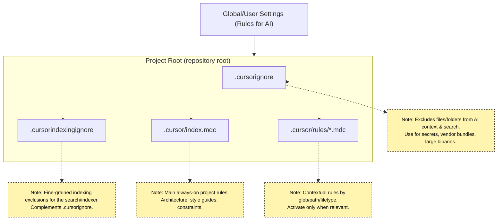

# Cursor Config Practices

## TL;DR

* Cursor configuration point sources
    * Cursor supports User Rules (global, via Settings UI) 
    * Project Rules in `<repo>/.cursor/rules/` (versioned with your repo).
    * Project MCP in `<repo>/.cursor/mcp.json` (versioned with your repo).
    * There’s also MCP config at global `~/.cursor/mcp.json`


## Practices 

* Keep User Rules minimal and push anything project-specific into repo rules, since User Rules aren’t file-based for easy sharing.
* Maintain a central repo ~/ai-idioms

```shell
    ai-idioms/
        scripts/    (scripts for install/refresh/linking/updating)
        cursor/
            docs.md
            user/   (user globval configuration)
                mcp.json
            rules/
                java-idiom-new-code.mdc
                java-idiom-unit-tests.mdc
            mcp
                mcp-docs.md
                mcp-context7.json
                mcp-snowflake.json
```

* `~/ai-idioms` repo is maintained with a main branch and feature branches
* Initialize `~/.cursor/mcp.json` by copying `~/ai-idioms/cursor/mcp/mcp-context7.json` file over to  `~/.cursor/mcp.json` and then edit it
* Copy over `~/ai-idioms/cursor/user/mcp.json` to `~/.cursor/mcp.json` and edit it
* Copy over rule files from `~/ai-idioms/cursor/rules` to `<repo>/.cursor/rules/` 
* Periodically check for differences between rules in the workspace repositories and the files of the same name in `~/ai-idioms/cursor/rules`
* A template file `techstack-idiom-template.mdc`should be pre-populated in `~/ai-idioms/cursor/rules`
* Secrets and Credentials should not be managed in this repo
* There can be `.cursor/rules/` folders under a repository ( `<repo>/.cursor/rules/`) or under any sub-folder ( `<repo>/sub1/sub2/.cursor/rules/`)
* Functionality to be supported 
    * Update the `~/ai-idioms/`repository
    * Compare  `~/.cursor/mcp.json` to its source in `~/ai-idioms/`repository
    * Compare  `~/.cursor/mcp.json` to its source in `~/ai-idioms/`repository
    * List the rules files in `~/ai-idioms/cursor/rules` 
    * Compare repository or sub folder cursor rules folder files to `~/ai-idioms/cursor/rules` files of the same name
    * Update repository or sub folder cursor rules folder file from `~/ai-idioms/cursor/rules` folder
    * Published  repository or sub folder cursor rules folder file to `~/ai-idioms/cursor/rules` folder (may overwrite)




Framework for AI usage

https://learn-cursor.com/en/rules

https://gist.github.com/aashari/07cc9c1b6c0debbeb4f4d94a3a81339e

https://github.com/PatrickJS/awesome-cursorrules

https://huggingface.co/blog/lynn-mikami/cursor-rules

https://apidog.com/blog/awesome-cursor-rules/

https://medium.com/@oscarleo/how-to-make-cursor-one-shot-complex-projects-9f9790d957c9

https://github.com/sanjeed5/awesome-cursor-rules-mdc

https://forum.cursor.com/t/best-practices-cursorrules/41775

Look at generating cursor rules from my ChatGPT description of clean arch/feature folder structure


1. New dev
2. Troubles shooting https://medium.com/realworld-ai-use-cases/its-actually-extremely-hard-for-cursor-ai-to-fix-bugs-so-here-s-what-to-do-instead-45327accddf4
3. Third
4. Functional requirements gathering
    1. Events
    2. Data
    3. Use cases
5. Modeling
    1. Domains 
    2. Subdomains
    3. Use cases
    4. Services
6. Architecture
    1. Clean architecture
7. Java Coding https://github.com/jabrena/java-cursor-rules, https://docs.cursor.com/guides/languages/java, https://medium.com/@tugkan.boz/enhancing-test-automation-with-ai-standardization-and-efficiency-through-cursorrules-fda45bbbb202
8. Critical read : https://medium.com/@oscarleo/how-to-make-cursor-one-shot-complex-projects-9f9790d957c9
    1. Project structure. 
    
    https://medium.com/elca-it/feature-based-modular-code-organization-in-java-e4b611d6c103, look at Dynalist for folder structure. 
    
    1. Top level coding
    2. Unit tests. https://medium.com/@tugkan.boz/enhancing-test-automation-with-ai-standardization-and-efficiency-through-cursorrules-fda45bbbb202
    3. 
    4. Functional tests
    5. I Infrastructure test
    6. ,

Add in inclusion of dw code base viable or tree 

https://levelup.gitconnected.com/license-to-kill-coding-with-cursor-ai-agents-1df3d6a0bfe8


# References


https://learn-cursor.com/en/rules

https://gist.github.com/aashari/07cc9c1b6c0debbeb4f4d94a3a81339e

[https://medium.com/vibe-coding/cursors-new-update-it-s-really-good-b022a6fa4129](https://medium.com/vibe-coding/cursors-new-update-it-s-really-good-b022a6fa4129)

https://github.com/PatrickJS/awesome-cursorrules

https://huggingface.co/blog/lynn-mikami/cursor-rules

https://apidog.com/blog/awesome-cursor-rules/

https://medium.com/@oscarleo/how-to-make-cursor-one-shot-complex-projects-9f9790d957c9

https://github.com/sanjeed5/awesome-cursor-rules-mdc

Troubles shooting https://medium.com/realworld-ai-use-cases/its-actually-extremely-hard-for-cursor-ai-to-fix-bugs-so-here-s-what-to-do-instead-45327accddf4

Java Coding https://github.com/jabrena/java-cursor-rules, https://docs.cursor.com/guides/languages/java, https://medium.com/@tugkan.boz/enhancing-test-automation-with-ai-standardization-and-efficiency-through-cursorrules-fda45bbbb202

https://medium.com/@oscarleo/how-to-make-cursor-one-shot-complex-projects-9f9790d957c9

https://medium.com/elca-it/feature-based-modular-code-organization-in-java-e4b611d6c103, look at Dynalist for folder structure. 

https://levelup.gitconnected.com/license-to-kill-coding-with-cursor-ai-agents-1df3d6a0bfe8


